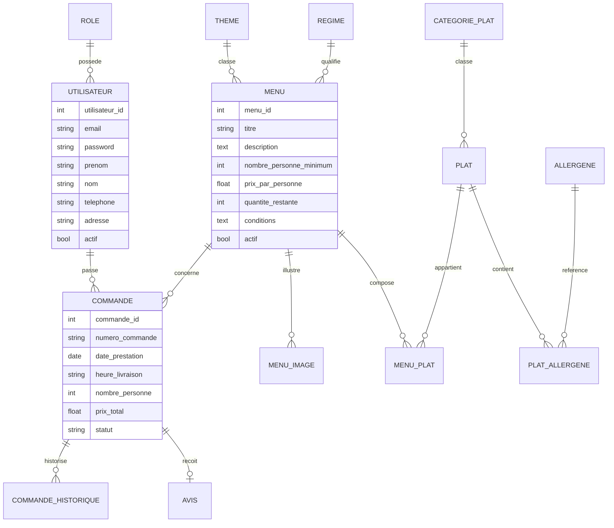
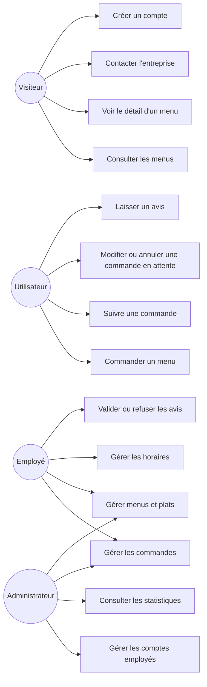
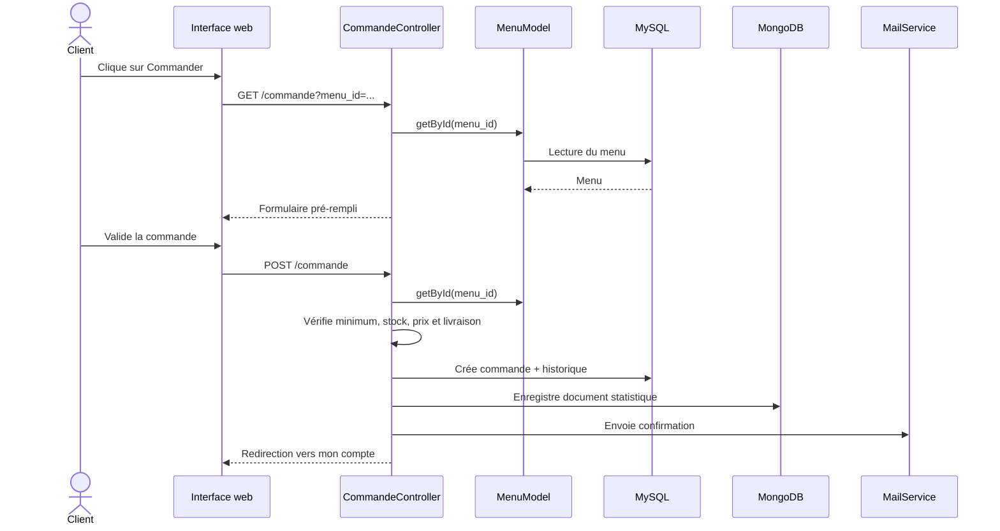

# Documentation technique - Vite & Gourmand

## Réflexion technologique initiale

Le sujet n'impose aucune technologie précise, sauf l'utilisation d'une base relationnelle et d'une base non relationnelle. Le choix retenu est une application PHP 8 avec une architecture MVC simple, PDO pour l'accès MySQL et MongoDB pour les statistiques.

PHP/PDO est adapté au contexte de l'ECF car la stack est simple à déployer, lisible, compatible avec MySQL et suffisante pour une application de gestion. MySQL stocke les données métier structurées. MongoDB est utilisé pour les statistiques de commandes par menu, afin de séparer la partie analytique de la base relationnelle.

## Stack

| Couche | Technologie |
|---|---|
| Front-end | HTML5, CSS3, Bootstrap 5, JavaScript |
| Back-end | PHP 8.1, MVC |
| Base relationnelle | MySQL 8 via PDO |
| Base non relationnelle | MongoDB |
| Emails | PHPMailer via Composer |
| Graphiques | Chart.js |

## Environnement local

Prérequis :

- PHP 8.1 ou plus
- MySQL 8
- Composer pour installer PHPMailer et MongoDB PHP library
- Base `vite_gourmand`

Commandes :

```bash
composer install
mysql -u root -p -e "CREATE DATABASE vite_gourmand CHARACTER SET utf8mb4 COLLATE utf8mb4_unicode_ci;"
mysql -u root -p vite_gourmand < sql/vite_gourmand.sql
php -S localhost:8080 -t public/
```

## Sécurité

- Les mots de passe sont hashés avec `password_hash()` en bcrypt.
- Les formulaires POST utilisent un token CSRF.
- Les accès aux espaces utilisateur, employé et administrateur sont protégés par rôle.
- Les requêtes SQL utilisent PDO et des requêtes préparées.
- Les entrées utilisateur sont nettoyées avant affichage avec `htmlspecialchars`.
- Les comptes employés peuvent être désactivés.
- Aucun compte administrateur ne peut être créé depuis l'application.
- Les messages d'oubli de mot de passe évitent l'énumération d'emails.

## RGPD

- Les données demandées sont limitées à la commande : identité, email, téléphone, adresse.
- L'utilisateur peut modifier ses informations personnelles.
- Les mots de passe ne sont jamais stockés en clair.
- Les comptes employés peuvent être désactivés en cas de départ.
- Les finalités sont liées à la gestion des commandes et au contact client.

## Accessibilité RGAA

- Langue de page déclarée en français.
- Navigation principale sémantique.
- Lien d'évitement vers le contenu principal.
- Labels associés aux champs de formulaire.
- Feedback via messages d'alerte.
- Contrastes renforcés sur les boutons et badges.
- Structure avec titres hiérarchisés.

## Modèle conceptuel de données



## Diagramme de cas d'utilisation



## Diagramme de séquence - Commande d'un menu



## Déploiement

1. Créer une base MySQL sur l'hébergeur.
2. Importer `sql/vite_gourmand.sql`.
3. Déployer le code depuis GitHub.
4. Installer les dépendances Composer.
5. Configurer les variables d'environnement : base SQL, SMTP, URL et MongoDB.
6. Définir le dossier `public/` comme racine web.
7. Vérifier les parcours : accueil, menus, connexion, commande, espaces employé/admin.
