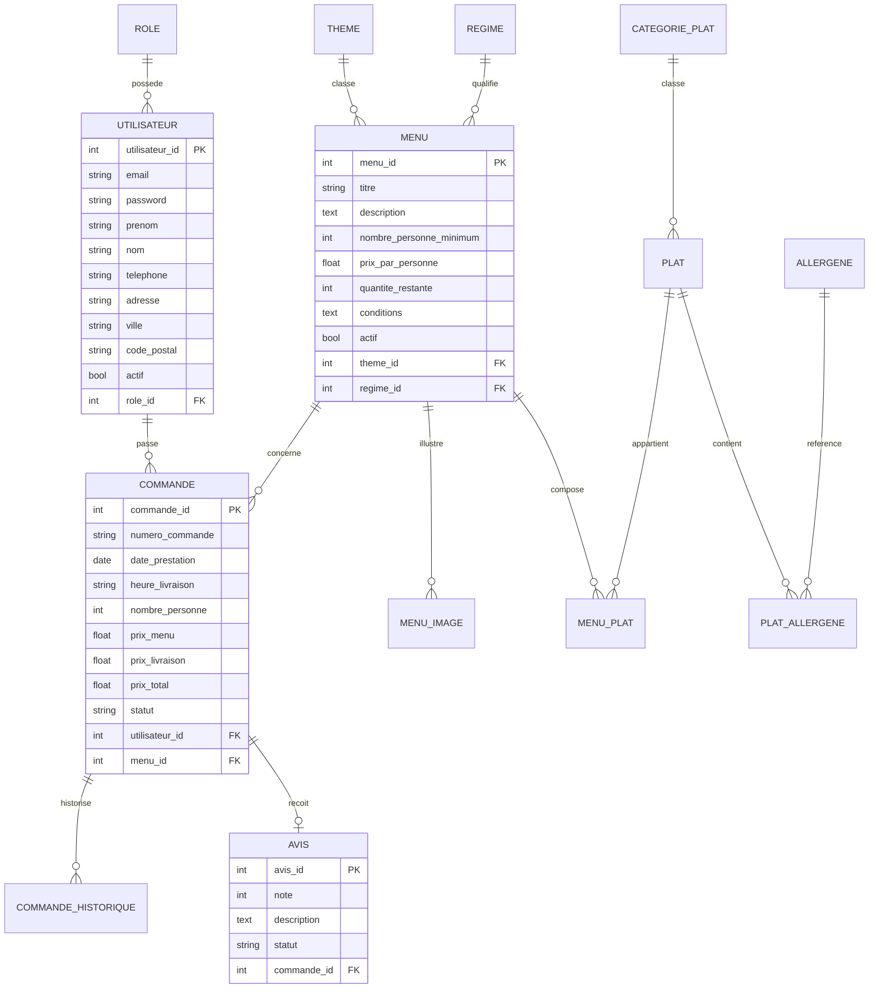
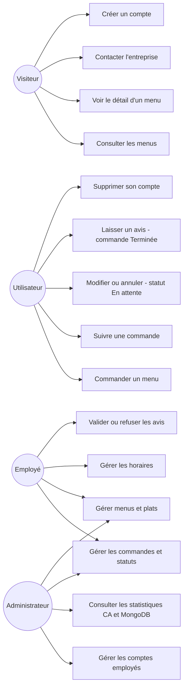
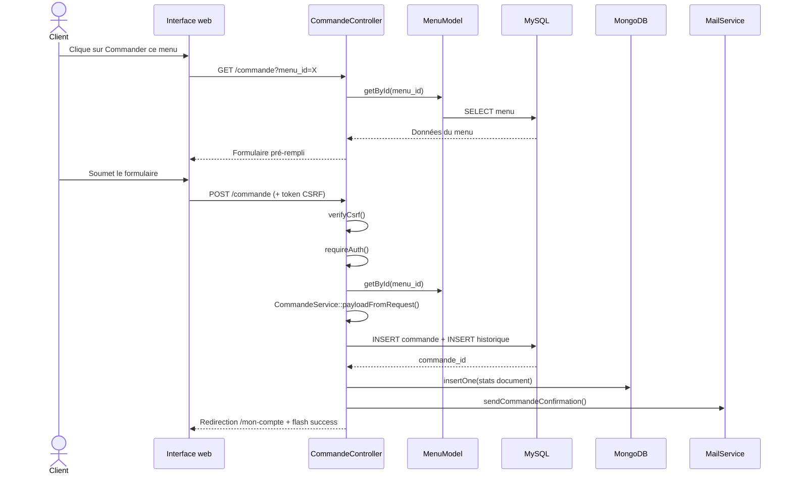

# Documentation technique — Vite & Gourmand

## Réflexion technologique initiale

Le cahier des charges n'impose aucune technologie à l'exception d'une base relationnelle et d'une base non relationnelle. Le choix retenu est une application **PHP 8.2** avec une architecture **MVC maison** (sans framework), **PDO** pour MySQL et la librairie officielle `mongodb/mongodb` pour les statistiques.

**Justification des choix :**

| Choix | Justification |
|---|---|
| PHP 8.2 sans framework | Maîtrise totale de l'architecture, sans dépendance lourde, déploiement simplifié |
| PDO + requêtes préparées | Sécurité SQL (injection), portabilité, standard PHP |
| MySQL 8 | Base relationnelle solide, bien supportée par Railway |
| MongoDB Atlas | Séparation des données analytiques des données métier, conformité NoSQL exigée |
| PHPMailer | Bibliothèque de référence PHP pour SMTP, gère TLS, HTML/texte, encodage UTF-8 |
| Bootstrap 5.3 | Responsive natif, composants prêts, personnalisable via variables CSS |
| Chart.js | Légère, simple à intégrer, graphiques en canvas sans dépendance serveur |
| Railway | Déploiement depuis GitHub, MySQL intégré, variables d'environnement, HTTPS auto |

---

## Stack technique

| Couche | Technologie | Version |
|---|---|---|
| Serveur | PHP built-in (`php -S`) | PHP 8.2 |
| Front-end | HTML5, CSS3, Bootstrap | 5.3.3 |
| Icônes | Bootstrap Icons | 1.11.3 |
| Graphiques | Chart.js | CDN |
| Back-end | PHP 8.2, architecture MVC | — |
| Base relationnelle | MySQL 8 via PDO | — |
| Base non relationnelle | MongoDB Atlas | ext-mongodb 2.x |
| Emails | PHPMailer | ^6.9 |
| MongoDB library | mongodb/mongodb | ^2.0 |
| Déploiement | Railway | — |

---

## Configuration de l'environnement local

### Prérequis

- PHP >= 8.2 avec extensions : `pdo_mysql`, `mbstring`, `zip`, `mongodb`
- MySQL >= 8.0
- Composer
- (Optionnel) MongoDB local ou compte MongoDB Atlas

### Installation

```bash
# 1. Installer les dépendances Composer
composer install

# 2. Copier et configurer les variables d'environnement
cp .env.example .env
# Éditer .env avec vos paramètres DB, SMTP et MongoDB

# 3. Créer la base de données et importer le schéma
mysql -u root -p -e "CREATE DATABASE vite_gourmand CHARACTER SET utf8mb4 COLLATE utf8mb4_unicode_ci;"
mysql -u root -p vite_gourmand < sql/vite_gourmand.sql

# 4. Lancer le serveur de développement
php -S localhost:8080 -t public/
```

Accès local : `http://localhost:8080`

### Variables d'environnement

| Variable | Description |
|---|---|
| `DB_HOST` | Hôte MySQL |
| `DB_NAME` | Nom de la base |
| `DB_USER` | Utilisateur MySQL |
| `DB_PASS` | Mot de passe MySQL |
| `MONGO_URI` | URI de connexion MongoDB |
| `MONGO_DB` | Nom de la base MongoDB |
| `MAIL_HOST` | Hôte SMTP |
| `MAIL_PORT` | Port SMTP |
| `MAIL_USER` | Identifiant SMTP |
| `MAIL_PASS` | Mot de passe SMTP |
| `MAIL_FROM` | Adresse expéditeur |
| `BASE_URL` | URL publique de l'application |

---

## Architecture MVC

```
public/
└── index.php          ← Point d'entrée unique, routeur

src/
├── config/
│   ├── config.php     ← Constantes et variables d'environnement
│   └── Database.php   ← Singleton PDO
├── controllers/       ← Logique de traitement des requêtes
├── models/            ← Accès aux données (SQL)
├── services/          ← Services métier (Mail, Stats, Commande, MenuAdmin)
├── views/
│   ├── layouts/       ← Template principal (main.php)
│   ├── pages/         ← Vues par fonctionnalité
│   └── partials/      ← Composants réutilisables
└── helpers.php        ← Fonctions utilitaires globales
```

Le routeur dans `index.php` dispatche les requêtes vers les controllers selon la méthode HTTP et l'URI. Les routes sont protégées par groupe (`GET_AUTH`, `POST_EMPLOYE`, `GET_ADMIN`, etc.).

---

## Sécurité

| Mesure | Implémentation |
|---|---|
| Mots de passe | `password_hash()` bcrypt, coût 12 |
| CSRF | Token en session, vérifié sur chaque POST via `verifyCsrf()` |
| Injections SQL | PDO + requêtes préparées sur 100 % des requêtes |
| XSS | `htmlspecialchars()` + `ENT_QUOTES` sur toutes les sorties |
| Contrôle d'accès | `requireAuth()` / `requireRole()` dans le routeur |
| Isolation commandes | `currentUserCommande()` vérifie que la commande appartient à l'utilisateur |
| Suppression compte | Réservée au rôle `utilisateur` uniquement (`hasRole(ROLE_USER)`) |
| Compte admin | Impossible à créer depuis l'application |

---

## RGPD

- Données collectées limitées aux besoins de la commande : identité, email, téléphone, adresse.
- Mots de passe jamais stockés en clair (bcrypt).
- Droit à l'effacement implémenté : bouton "Supprimer mon compte" dans l'espace client.
- Durée de conservation mentionnée dans les mentions légales (3 ans après dernière commande).
- Aucun cookie publicitaire ou de traçage tiers.

---

## Accessibilité RGAA

- `lang="fr"` sur la balise `<html>`.
- Lien d'évitement `<a href="#main-content">` en haut du layout.
- `<main id="main-content" tabindex="-1">` ciblable au clavier.
- Labels associés à tous les champs via `for`/`id`.
- Toutes les images ont un attribut `alt` (vide + `aria-hidden="true"` pour les images décoratives).
- Contrastes WCAG AA respectés sur toutes les combinaisons texte/fond.
- Rôles ARIA sur les composants interactifs (accordéons, modales, tableaux).

---

## Modèle conceptuel de données



---

## Diagramme de cas d'utilisation



---

## Diagramme de séquence — Commande d'un menu



---

## Déploiement sur Railway

### Prérequis Railway
- Compte Railway connecté à GitHub
- Service MySQL Railway ajouté au projet
- (Optionnel) Compte MongoDB Atlas pour les statistiques

### Étapes

1. Pousser le code sur GitHub (`main` ou `develop`).
2. Créer un projet Railway et connecter le dépôt GitHub.
3. Railway détecte le `Dockerfile` et build l'image automatiquement.
4. Ajouter un service MySQL Railway et le lier à l'application.
5. Importer `sql/vite_gourmand.sql` via l'onglet **Data** du service MySQL.
6. Configurer les variables d'environnement dans Railway :

```
DB_HOST     = ${{MySQL.MYSQLHOST}}
DB_NAME     = ${{MySQL.MYSQLDATABASE}}
DB_USER     = ${{MySQL.MYSQLUSER}}
DB_PASS     = ${{MySQL.MYSQLPASSWORD}}
BASE_URL    = https://<votre-domaine>.up.railway.app
MAIL_HOST   = smtp.gmail.com
MAIL_PORT   = 587
MAIL_USER   = votre@gmail.com
MAIL_PASS   = mot-de-passe-application-gmail
MAIL_FROM   = noreply@vitegourmand.fr
MONGO_URI   = mongodb+srv://...
MONGO_DB    = vite_gourmand_stats
```

7. Dans Railway → Settings → Networking : définir le port à **8080**.
8. Générer un domaine Railway depuis l'onglet **Settings → Domains**.
9. Vérifier les parcours : accueil, menus, commande, espaces employé et admin.

### Dockerfile utilisé

```dockerfile
FROM php:8.2-cli
RUN apt-get update && apt-get install -y \
    libzip-dev libpng-dev libssl-dev pkg-config \
    zip unzip curl autoconf g++ make \
    && docker-php-ext-install pdo pdo_mysql zip \
    && pecl install mongodb-2.1.0 \
    && docker-php-ext-enable mongodb \
    && apt-get remove -y autoconf g++ make \
    && apt-get autoremove -y \
    && rm -rf /var/lib/apt/lists/*
COPY --from=composer:latest /usr/bin/composer /usr/bin/composer
WORKDIR /var/www/html
COPY . .
ENV COMPOSER_ALLOW_SUPERUSER=1
RUN composer install --no-dev --optimize-autoloader --no-interaction
CMD ["sh", "-c", "php -S 0.0.0.0:${PORT:-8080} -t public"]
```

> Le serveur built-in PHP est suffisant pour le contexte ECF. En production réelle, un serveur Nginx + PHP-FPM serait préférable.
